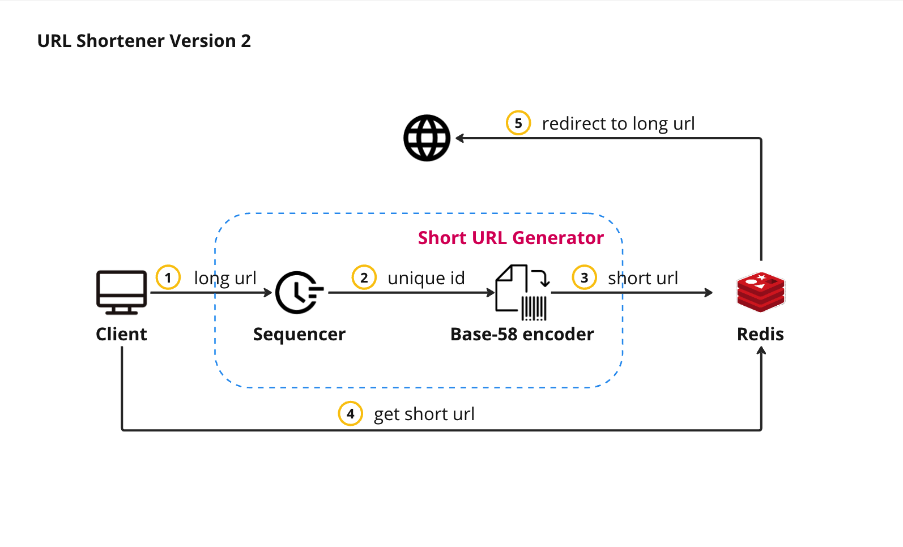
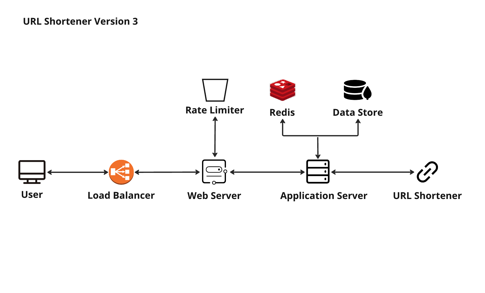

# Version1

# Version2

## Architecture of Version2

In version 2 of the project, I have made improvements by introducing the Snowflake algorithm to implement the sequencer. This algorithm generates a unique 64-bit ID in base-10 format, which can be further converted to a base-64 short URL. However, using base-64 encoding for the short URL may introduce readability issues due to the presence of look-alike characters such as O (capital o) and 0 (zero), I (capital I), and l (lower case L). Additionally, characters like + and / could cause problems due to other system-dependent encodings.

To address these concerns, I have decided to switch from base-64 to base-58 encoding for the short URLs. Base-58 encoding excludes six characters to enhance readability and reduce the possibility of confusion. By utilizing base-58 encoding, the sequencer generates a unique 64-bit ID in base-10 format, which is then passed through the Base-58 encoder to produce the short URL. This ensures that the generated short URLs are more human-friendly and less prone to confusion caused by similar-looking characters.

By employing the Snowflake algorithm and utilizing base-58 encoding, the project strikes a balance between uniqueness, readability, and compatibility, resulting in a more efficient and user-friendly URL shortening system.

## Pros, Cons, and Areas for Improvement

### Pros of version2:

1. Simple and Lightweight: The implementation is relatively straightforward and easy to understand. It focuses on the core functionality of generating and retrieving short URLs without unnecessary complexity.
2. Integration with Redis: Utilizing Redis as the key-value store allows for efficient storage and retrieval of short URLs. Redis is known for its performance and low latency, making it suitable for handling high request rates.
3. Randomized Short URLs: The `generateShortUrl` method generates short URLs using a random selection of alphanumeric characters. This randomness helps ensure uniqueness and reduces the likelihood of collisions.
4. Flexibility with Dependency Injection: By using the `RedisTemplate` as a dependency injected into the `UrlShortenerService`, the implementation becomes more flexible and easily adaptable to different Redis configurations or alternative storage solutions.

### Cons and areas for improvement:

1. Lack of Customization: The current implementation does not provide options for customizing the length or format of the generated short URLs. Adding flexibility to accommodate different requirements, such as allowing custom aliases or varying URL lengths, could enhance the usefulness of the service.
2. Limited Error Handling: Error handling is minimal in the given implementation. Consider adding appropriate exception handling and validation to handle scenarios like invalid URLs, duplicate short URLs, or failures in Redis operations.
3. Lack of Rate Limiting: Rate limiting is an essential aspect of a production-ready URL shortener service to prevent abuse or excessive usage. Implementing rate limiting mechanisms, such as throttling the number of requests per client, would enhance the system's robustness.
4. Scalability Concerns: While Redis is a performant and scalable data store, the current implementation does not address scaling concerns for handling a high volume of concurrent requests. Consider strategies for horizontal scaling, such as distributed caching or sharding, to ensure the system can handle increased traffic efficiently.
5. Lack of Persistence: The current implementation relies solely on Redis for storing long URLs. Consider introducing database persistence to ensure data durability and fault tolerance in case of Redis failures or restarts.

# Version3

- [x] Customize URL.
- [x] URL Validation.
- [ ] Duplicate URL Handling.
- [ ] Use MongoDB as main database.
- [ ] Use Redis as cache for MongoDB.
- [ ] Use Redis as rate limitor.
- [ ] User Accounts and Authentication.
- [ ] Statistics.
- [ ] UI/UX Improvements.
